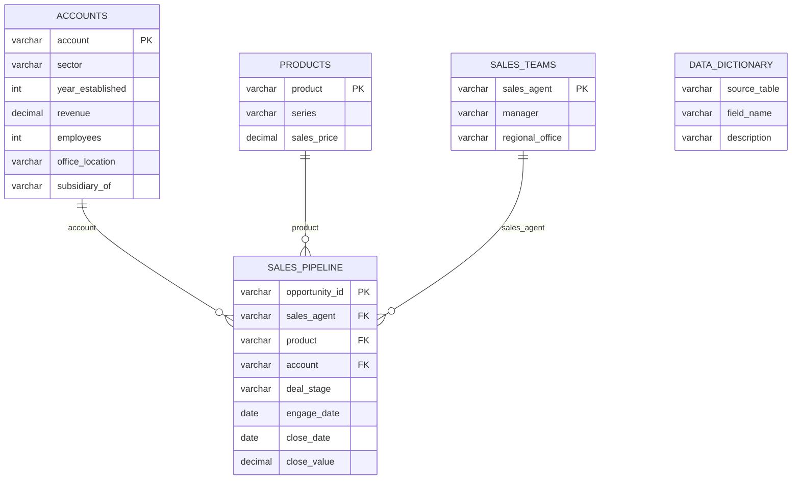

# CRM Sales Opportunities Schema Diagram

## Relationship Summary

| Table | Primary Key |
| --- | --- |
| accounts | account |
| products | product |
| sales_teams | sales_agent |
| sales_pipeline | opportunity_id |

| Foreign Key | References |
| --- | --- |
| sales_pipeline.account | accounts.account |
| sales_pipeline.product | products.product |
| sales_pipeline.sales_agent | sales_teams.sales_agent |

`data_dictionary` explains the CSV columns. It does not need a foreign key relationship for basic importing.
